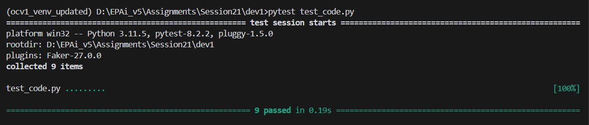
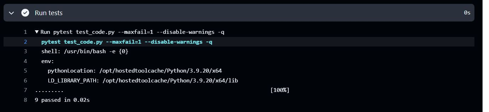

# EPAiV5-Session21 - Polymorphism and Special Methods


## Overview
The `AdvancedNumber` class is a custom numerical type implemented in Python that encapsulates a single numeric value, either an integer or a float, and extends its functionality with rich features. This class leverages Python's special methods to provide a seamless, intuitive experience for arithmetic, comparison, hashing, boolean conversion, and more. It also includes advanced features like callable behavior and custom formatting, making it versatile for diverse use cases.

## Features
### 1. Initialization and Representation
- Initialization:

An `AdvancedNumber` object is initialized with a numeric value (integer or float).
Example: `num = AdvancedNumber(42)`.

- String Representation:

`__str__`: Returns a user-friendly string, e.g., `"Value: 42"`.
`__repr__`: Provides a developer-friendly representation, e.g., `"AdvancedNumber(42)"`.

### 2. Arithmetic Operations
The class overloads standard arithmetic operators to work with both `AdvancedNumber` instances and plain numbers (int or float). Each operation returns a new `AdvancedNumber` object containing the result.

| Operator | Description    | Example     |
| -------- | -------------- | ----------- |
| +        | Addition       | num1 + num2 |
| -        | Subtraction    | num1 - num2 |
| *        | Multiplication | num1 * 3    |
| /        | Division       | num1 / 2.5  |
| %        | Modulus        | num1 % num2 |


#### Example :


```
num1 = AdvancedNumber(10)
num2 = AdvancedNumber(3)
result = num1 + num2  # result.value = 13

```

### 3. Comparison Operations
The class supports all standard comparison operators, enabling comparisons between `AdvancedNumber` objects or with plain numbers.

| Operator | Description              | Example      |
| -------- | ------------------------ | ------------ |
| <        | Less than                | num1 < num2  |
| <=       | Less than or equal to    | num1 <= 5    |
| >        | Greater than             | num1 > 7.5   |
| >=       | Greater than or equal to | num1 >= num2 |
| ==       | Equal to                 | num1 == 10   |
| !=       | Not equal to             | num1 != num2 |

### 4. Hashing and Boolean Conversion
- **Hashing:**

    - `__hash__`: Makes `AdvancedNumber` objects hashable, allowing them to be used as dictionary keys or in sets.
    - Example: `{AdvancedNumber(42): "Answer to Life"}`.

- **Boolean Conversion:**

    - `__bool__`: Evaluates to True if the value is non-zero, and False otherwise.
    - Example: `bool(AdvancedNumber(0)) # False`.


### 5. Callable Behavior
The class implements `__call__`, making objects callable. Calling an `AdvancedNumber` instance returns the square of its value.

#### Example :


```
num = AdvancedNumber(5)
print(num())  # Output: 25

```


### 6. Custom Formatting
`__format__` enables flexible string formatting:

- `{obj:.2f}`: Formats the value to two decimal places (e.g., `42.00`).
- `{obj:#x}`: Returns the hexadecimal representation for integer values.

#### Example :


```
num = AdvancedNumber(255)
print(f"{num:.2f}")  # Output: 255.00
print(f"{num:#x}")   # Output: 0xff

```

### 7. Destructor
The `__del__` method ensures that a message is printed when an `AdvancedNumber` object is deleted.

#### Example : `"AdvancedNumber with value 42 is being destroyed"`.

## Usage Examples
### Arithmetic Operations

```
a = AdvancedNumber(10)
b = AdvancedNumber(5)
print(a + b)  # Value: 15
print(a - b)  # Value: 5
print(a * 2)  # Value: 20
print(a / b)  # Value: 2.0
print(a % b)  # Value: 0
```

### Comparison Operations

```
a = AdvancedNumber(10)
b = AdvancedNumber(5)
print(a > b)  # True
print(a == 10)  # True
print(b <= 5)  # True
```

### Callable and Custom Formatting

```
num = AdvancedNumber(3)
print(num())  # Output: 9
print(f"{num:.2f}")  # Output: 3.00
print(f"{AdvancedNumber(255):#x}")  # Output: 0xff
```

### Hashing and Boolean Conversion


```
my_set = {AdvancedNumber(1), AdvancedNumber(2), AdvancedNumber(1)}
print(len(my_set))  # Output: 2
print(bool(AdvancedNumber(0)))  # Output: False
```

## Test Resuts

#### Local PC Test Execution



#### Workflow Actions



## Conclusion
The `AdvancedNumber` class demonstrates the power of Python's special methods, offering a rich, intuitive interface for numerical operations and more. It is a versatile tool for projects requiring custom numeric types and can serve as a foundation for learning or building advanced numerical abstractions.

---------------------------------------------------------------------------------------------------------------------------------------------------

**Submission by** - Hema Aparna M

**mail id** - mhema.aprai@gmail.com

---------------------------------------------------------------------------------------------------------------------------------------------------